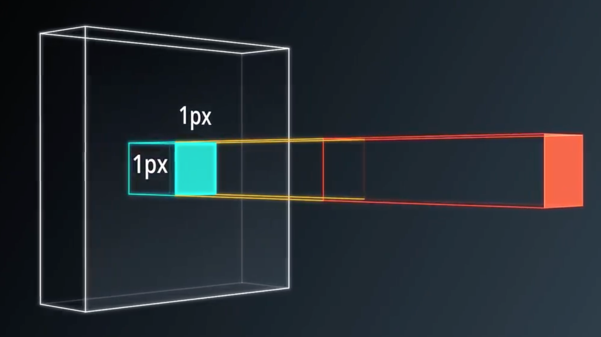
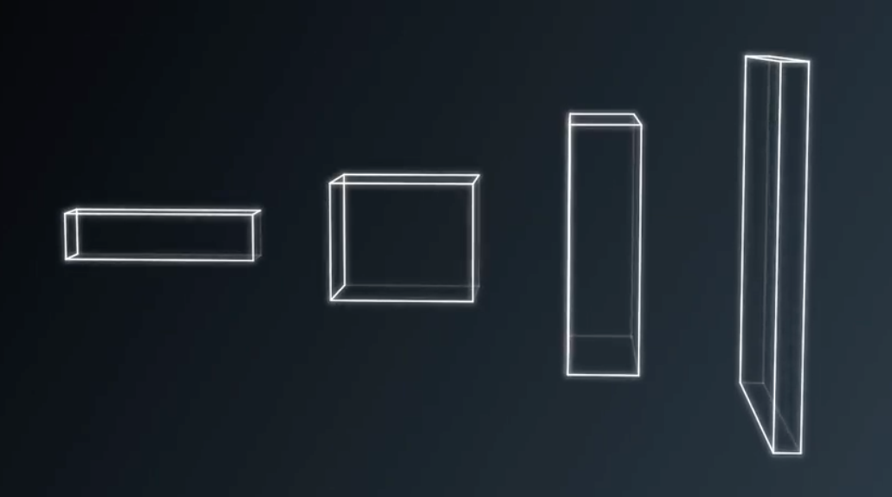
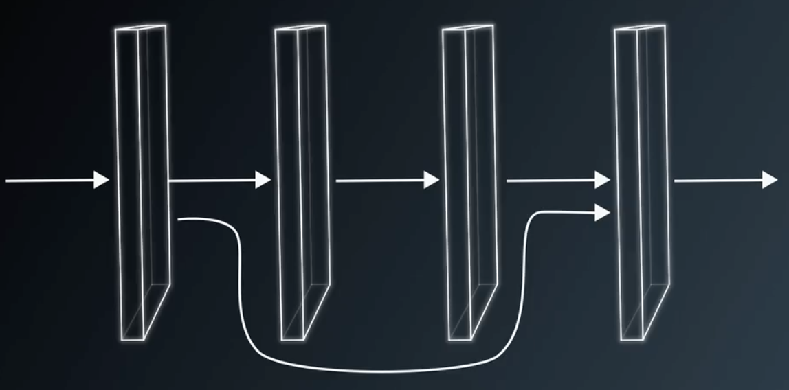
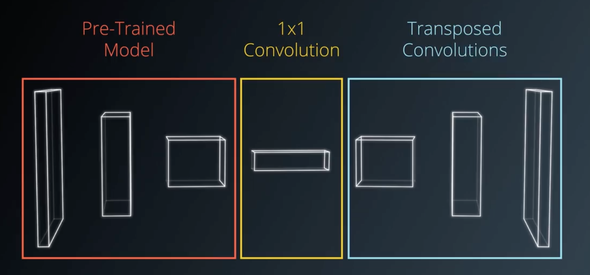

# Semantic-Segmentation

## Project Overview
In this project,we will label the pixels of a road in images using a Fully Convolutional Network(FCN) programmed in Python3.5 . We experimented with multiple epochs,batch size,learning rate,dropouts hyperparameter during the training. And finally, we settled on the following hyper parameters since the performence on test dataset is so well and do not over fit or under fit during the testing.

* epochs = 20
* learning rate = 0.0001
* batch size =1 (One 160x576 pixel RGB image)
* dropouts = 0.2


The following animation shows a shot of final results of this Fully Convolutional Network for Semantic Segmentation:


## Deep Neural Network Architecture

This neural network is by using *Layer 3, 4, 7* from vgg and having 1x1 convolutional layers,skip connections and upsampling. The following pictures show a short brief about these three special layers. (*pictures provided from Udacity*)

1x1 Convolution  ------>  |     Upsampling ------>        |      Skip Connections     |
:--------------------:|:------------------------:|:----------------------
|   |


## FCN(Fully Convolutional Network)
FCN is conprised of two main parts:encoder && decoder. The mechanism behind this network is that endocer extracts features that will later be used by decoder and decoder upscales the output of encoder. The following short graph of the construction of the FCN is shown below. (*pictures provided from Udacity*)

|--------------------Vgg Model------------------|---------1x1 Conv-------|---------------Upsampling-----------------------|



## Reflection

The difference between **a fully-connected layer** and **a fully-convolutional layer** is that:

* A fully connected layer obtains each neuron which is connected to every neuron in the previous layer and each connection has its own weight. Thus fully connected layers can only deal with input of a fixed size as it requires a certain amount of parameters to fully connect the input and output


* A fully convolutional layer has two components: encoder and decoder. Encoder is followed by decoder and the decoder upsamples the output of encoder to the original image size 


* The great advantage of using a fully convolutional layer instead of a fully connected layer is that a fully convolutional layer preserves the spatial information through the entire network and thus could work on image of any size

### Setup

#### Frameworks and Packages
Make sure you have the following is installed:
 - [Python 3](https://www.python.org/)
 - [TensorFlow](https://www.tensorflow.org/)
 - [NumPy](http://www.numpy.org/)
 - [SciPy](https://www.scipy.org/)

#### Dataset
Download the [Kitti Road dataset](http://www.cvlibs.net/datasets/kitti/eval_road.php) from [here](http://www.cvlibs.net/download.php?file=data_road.zip).  Extract the dataset in the `data` folder.  This will create the folder `data_road` with all the training a test images.


```python

```
